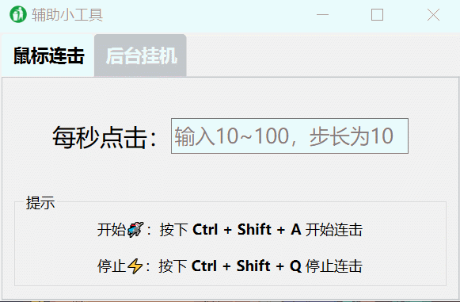

# Auxiliary Gadgets项目
## 项目简介
玩咸鱼之王小游戏时候，发现无法后台挂机，于是产生了这个项目。

使用了 `PySide6/PyQT` 将该 `Python` 项目封装成一个GUI小工具！


## 项目展示


<font color='bluesky' size=5> **工具展示**</font>




###  <font color='bluesky' size=5> 鼠标连机器</font>

- 使用非常简单，输入 `每秒点击次数`，然后按下键盘的 `Ctrl + Shift + A` 即可；

- 例如输入20，然后按下`Ctrl + Shift + A`（注意看左上角的 键盘显示器


### <font color='bluesky' size=5>后台挂机器</font>

- 使用非常简单，输入 `咸鱼之王`，然后点击 隐藏窗口即可。


## 项目组织

该小工具的项目结构如下所示：

```bash
auxiliary-gadgets/
├── controllers/
│   ├── __init__.py
│   └── controller_main.py
├── make/
│   └── 辅助小工具.spec
├── models/
│   ├── invoke_func/
│   │   ├── __init__.py
│   │   ├── mouse_click.py
│   │   └── window_operate.py
│   ├── __init__.py
│   └── model_main.py
├── views/
│   ├── resources/
│   │   ├── main.ui
│   │   ├── trash.png
│   │   └── utils.qrc
│   ├── ui/
│   │   ├── __init__.py
│   │   ├── main_ui.py
│   │   └── utils_rc.py
│   ├── widgets/
│   │   ├── __init__.py
│   │   └── view_main.py
│   └── __init__.py
├── main.py
├── README.md
└── requirements.txt
```


## 安装依赖

Python模块依赖
```bash
pip install -r requirements.txt
```


需要自己重新打包的话，使用make\辅助小工具.spec 就行了
```bash
pyinstaller 辅助小工具.spec
```


## 贡献
如果您想贡献代码或报告错误，请随时在GitHub上提交请求或问题。欢迎您的贡献！